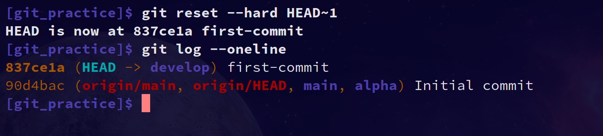

# Git Session 1

This repository contains my solution for Git Session 1 task.

## Solution Steps

### Part 1: Working on the develop Branch

1. Created two branch apha and develop then switched to the develop branch
2. Created two files (file1 and file2) and committed them separately
3. Viewed the commit history
   
4. Used git reset --hard to move back to the first commit
   
5. Used git reflog to find the previous state and restored it
   

### Part 2: Working with the alpha Branch

1. switched to alpha branch
2. Created file3 and committed it
3. Switched back to develop branch, created file4 and committed it
4. Viewed the branch structure using git log with graph
   

### Part 3: Rebase Operation

1. Performed a rebase of develop onto alpha
   

## Commands Used

```bash
# Branch setup
git branch develop
git branch alpha

# Part 1
git checkout develop
echo "Content for file1" > file1
echo "Content for file2" > file2
git add file1
git commit -m "first-commit"
git add file2
git commit -m "second-commit"
git log --oneline
git reset --hard HEAD~1
git reflog
git reset --hard <commit-hash>

# Part 2
git checkout alpha
echo "Content for file3" > file3
git add file3
git commit -m "third-commit"
git checkout develop
echo "Content for file4" > file4
git add file4
git commit -m "fourth-commit"
git checkout alpha
git log --oneline  --all --graph

# Part 3
git rebase develop
```
